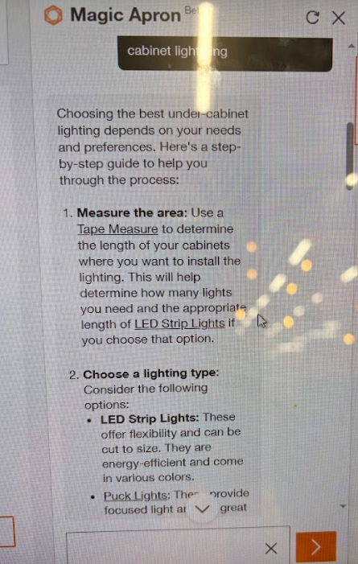

# 🛠️ ApronLLM: An Open Take on Magic Apron

**ApronLLM** is a passion project sparked by **Magic Apron** — Home Depot’s 2025 launch into DIY-focused language models. This initiative seeks to reimagine and extend that concept using open-source tools like **LLaMA 3**, combining **hybrid RAG** retrieval with **domain-specific fine-tuning** to serve DIY enthusiasts.

---

## 📚 Dataset Source

All instructional content is extracted from:

🔗 [Home Depot – DIY Projects & Ideas](https://www.homedepot.com/c/diy_projects_and_ideas/)

Each article is parsed and saved in **Markdown (`.md`) format**, designed for compatibility with **[Docusaurus](https://docusaurus.io/)** — enabling collaborative editing and structured documentation of DIY procedures.

---

## 🔧 Project Structure

| File/Folder             | Description                                                                 |
|-------------------------|-----------------------------------------------------------------------------|
| `vector_indexing.py`    | Builds dense vector index (FAISS) using embedded content.                  |
| `rag_inference_pipeline.py` | Runs a hybrid RAG pipeline to retrieve relevant context and generate responses. |
| `finetune_diy_model.py` | Fine-tunes LLaMA 3 using RAG-styled prompts specific to DIY domain tasks.  |
| `models/`               | Local LLM checkpoints and LoRA adapters.                                   |
| `vector_db/`            | FAISS database and associated metadata.                                    |

---

## 🧰 ApronLLM vs Magic Apron

This project supports:
- Retrieval-augmented response generation for DIY/home repair use cases.
- Instructional model fine-tuning using structured, real-world articles.
- Deployment of a personalized assistant grounded in Home Depot-style content.

---

## 🚧 Project Status

- ✅ Data scraping and Markdown formatting complete
- ✅ FAISS vector indexing script implemented
- ✅ Initial fine-tuning with RAG-formatted prompts
- ✅ Inference pipeline operational
- 🚧 Integration with Docusaurus underway
- 🚧 Future deployment on **Jetson Orin Nano** planned

---

## 🚀 Future Plans

- Develop a lightweight **local inference pipeline** for Jetson Orin Nano.
- Expand dataset to include hardware guides, material specs, and store metadata.
- Enable multiple contributor edits via Docusaurus-powered docs.
- Add evaluation scripts comparing responses against Magic Apron benchmarks.

---

## 🔑 Keywords

`Magic Apron`, `Home Depot`, `DIYer`, `Markdown`, `LLM`, `LLaMA3`, `LoRA`, `content extraction`, `RAG`, `Jetson Nano`, `Docusaurus`

---

> This is a learning-focused exploration of open-source LLM development in a real-world domain. Feedback and contributions welcome!
